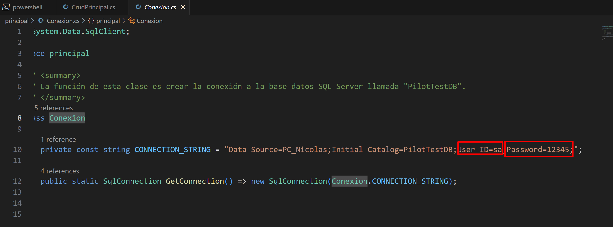
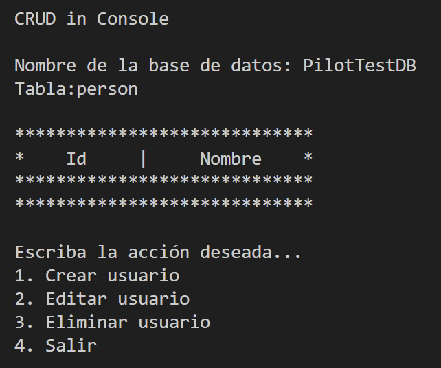
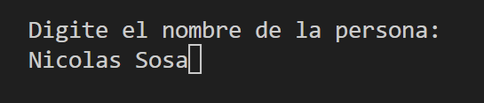
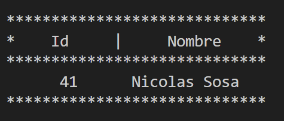

# CrudInConsole
Esta solución es un simple CRUD en consola, está elaborado con c# en .Net 7, y se conecta a una base de datos Microsoft
SQL Server.

Para desplegar esta aplicación deberá realizar lo siguiente:
<ul>
    <li>Abra el proyecto en su IDE de preferencia, es recomendable usar Visual Studio Code o Visual Studio. El proyecto
        se encuentra en el directorio “CrudInConsole” ubicado en el directorio raíz de este repositorio.</li>
    <li>Importe la base de datos SQL Server en su equipo. El script “PilotTestDB.sql” se encuentra ubicado en el
        directorio raíz del repositorio, úselo para realizar dicho proceso.</li>
    <li>En el archivo “Conexion.cs” modifique los valores de “ID” y “Password” conforme a las credenciales de su motor
        de base de datos SQL Server:</li>
     
    
     
     
    <li>Importe el ensamblado “System.Data.SqlClient” para que la aplicación logre conectarse a la base de datos.</li>
</ul>

<h3>Pantallazos:</h3>

  

  

